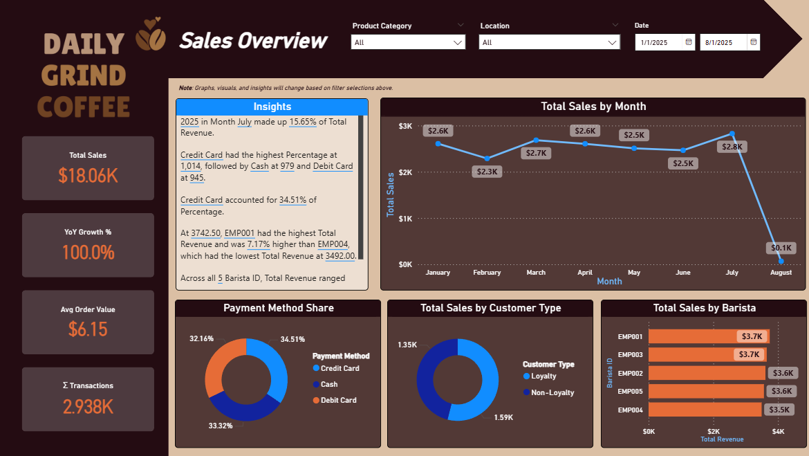
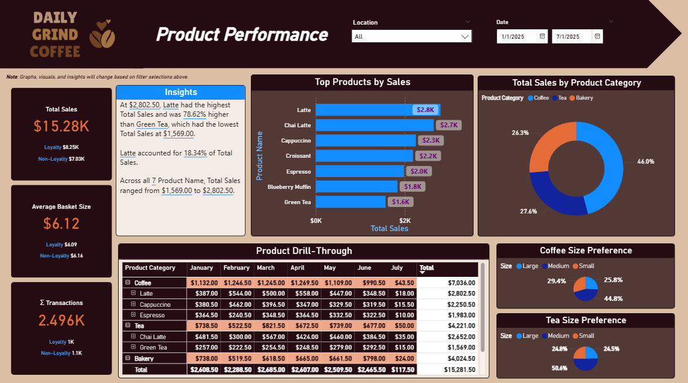
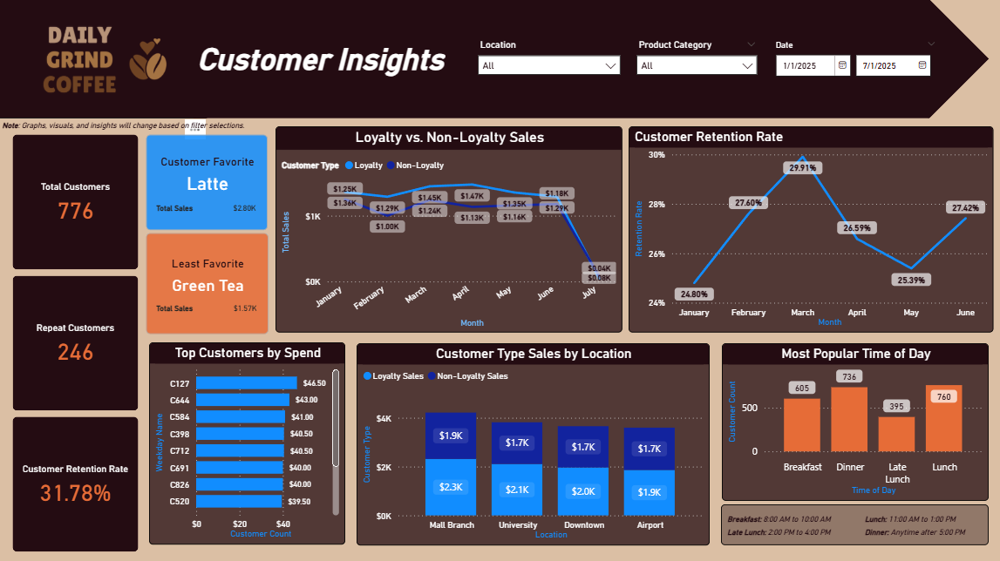

# coffee-shop-sales-bi-dashboard
**Daily Grind Coffee Sales BI Dashboard**

*A Power BI Case Study: from flat file ➡️ star schema ➡️ actionable insights*

## 📌 Project Overview
This project transforms raw point-of-sale transactions into a scalable business intelligence solution. Beyond visualizing a flat CSV file, the dataset was re-engineered into a star schema, enhanced with DAX measures, and delivered as interactive Power BI dashboards reporting on sales, product performance, and customer behavior.

## ‼️ Why It Matters
This mirrors how analytics is done in the real world — *clean data model, robust KPIs, and decision-ready insights.*

## 📸 Screenshots
Below are selected previews from my **Daily Grind Coffee Shop Analytics** dashboards and supporting analysis.

Each screenshot highlights a different stakeholder perspective and demonstrates how the project translates raw data into actionable insights.  

## ▶️ **Sales Overview**
*High-level KPIs (Total Sales, Average Order Value, YoY Growth) with sales trends over time.*

This view helps executives quickly assess business performance and growth patterns.*

## ▶️ **Product Performance**
*Top 10 Products by Revenue and Size Preferences (e.g., coffee cup and tea cup sizes).*

This page highlights category trends and gives product managers actionable insights into pricing, upselling, and promotions.

## ▶️ **Customer Insights**
*Breakdown of Loyalty vs Non-Loyalty  Sales, Customer Retention Rates, and Repeat vs New Customers.*

Designed for marketing and operations teams to measure engagement and program effectiveness.

## 📕 **Table of Contents**
- Overview
- Dataset
- Methodology
- Data Model (Star Schema)
- Key DAX Measures
- Dashboards
- Insights
- Limitations & Next Steps
- How to Use
- Repo Structure
- Skills Demonstrated
- Author

## 📊 **Dataset**

**File**: *coffee_shop_sales.csv*

- **Rows / Columns**: 4,998 transactions, 15 original columns

- **Scope**: Multiple locations; includes products, customers (loyalty/guest), employees (baristas), timestamps, prices, and payment methods

- **Nature**: Fictional business (Daily Grind Coffee) with realistic POS fields

**Data fields include**:
- **Transaction**s: ID, Date, Time, Location, Payment Method

- **Products**: ID, Name, Category, Size, Unit Price, Quantity, Total Price

- **Customers**: Customer ID, Loyalty Points Earned

- **Employees**: Barista ID

## 🔎 **Methodology**

**1. Data Cleaning (Power Query)**

- Standardized types (Date, Time, numeric).

- Addressed missing values:

- size → “OneSize” for non-beverage items

- missing customer_id → mapped to Guest for analysis
- Verified uniqueness of transaction_id.

**2. Data Modeling (Power Query → Model View)**

- Converted the flat file into a star schema (FactSales + dimensions).
- Added derived attributes: hour, minute, weekday, AM/PM, time-of-day buckets, weekend flags.
- Created a proper DimDate table for time intelligence.

**3. DAX (Power BI)**
- Authored measures for Total Sales, AOV, YTD/PY sales, YoY%, transactions, customer counts, loyalty vs. non-loyalty, new vs. repeat, retention rate, etc.

**4. Dashboards**
- Built three pages: Sales Overview, Product Performance, Customer Insights with slicers, drill-through, and narrative flow.

## ⭐️ **Data Model (Star Schema)**

**FactSales**
transaction_id, transaction_date, transaction_time, product_id, customer_id, barista_id, location, payment_method, quantity, unit_price, total_price, loyalty_points_earned, customer_type, hour, minute, second, weekday_name, is_weekend_flag, am_pm_flag, time_of_day

**DimProducts**
product_id, product_name, product_category, size

**DimCustomers**
customer_id, lifetime_spend (calc), lifetime_points (calc), is_repeat_customer_flag (calc), customer_type (Guest/Loyalty)

**DimEmployees**
barista_id

**DimDate**
date, year, month, monthNumber, quarter, weekday, weekNumber

**DimLocation**
location, store_type (Airport, University, Mall, Downtown)

**Relationships**

- FactSales[product_id] → DimProducts[product_id]

- FactSales[customer_id] → DimCustomers[customer_id]

- FactSales[barista_id] → DimEmployees[barista_id]

- FactSales[location] → DimLocation[location]

- FactSales[transaction_date] → DimDate[Date]

- Why star schema? Flexibility, performance, clarity, and scalability (future integration with SQL Server / warehouse).

## ➗️ **Key DAX Measures**

All formulas use a monospaced font for readability.

-- Core
total_sales = SUM(FactSales[total_price])

count_transactions = DISTINCTCOUNT(FactSales[transaction_id])

average_order_value = DIVIDE([total_sales], [count_transactions])

-- Time Intelligence (requires related DimDate)
total_sales_ytd =
TOTALYTD( [total_sales], DimDate[Date] )

total_sales_py =
CALCULATE( [total_sales], SAMEPERIODLASTYEAR(DimDate[Date]) )

total_sales_yoy_pct =
DIVIDE( [total_sales_ytd] - [total_sales_py], [total_sales_py] )

-- Loyalty splits
total_sales_loyalty =
CALCULATE( [total_sales], FactSales[customer_type] IN { "Loyalty" } )

total_sales_nonloyalty =
CALCULATE( [total_sales], FactSales[customer_type] IN { "Non-Loyalty" } )

-- Customers
count_customers = DISTINCTCOUNT(FactSales[customer_id])

count_customers_loyalty =
CALCULATE( [count_customers], FactSales[customer_type] IN { "Loyalty" } )

count_customers_nonloyalty =
CALCULATE( [count_customers], FactSales[customer_type] IN { "Non-Loyalty" } )

-- Repeat Customers
retained_customers =
VAR current_month = MAX('DimDate'[Date]) VAR 
previous_month = EOMONTH(current_month, -1)VAR 
customers_previous_month = 
CALCULATETABLE(VALUES(FactSales[customer_id]), 
DATESINPERIOD('DimDate'[Date], previous_month, 1, MONTH)) VAR 
customers_current_month = 
CALCULATETABLE(VALUES(FactSales[customer_id]), 
DATESINPERIOD('DimDate'[Date], current_month, 1, MONTH)) RETURN 
COUNTROWS(INTERSECT(customers_previous_month, 
customers_current_month))

active_customers =
DISTINCTCOUNT(FactSales[customer_id])

customer_retention_rate = DIVIDE([retained_customers], CALCULATE([Active Customers], 
DATEADD('DimDate'[Date], -1, MONTH)))

## 📈 **Dashboards**

**1) Sales Overview**

**Filters**: Product Category, Date, Location

**KPIs**: Total Sales, YoY Growth %, Average Order Value, Total Transactions

**Visuals**:

- Sales by Month (line)

- Payment Method Share (donut)

- Sales by Customer Type (donut)

- Sales by Barista (bar)

- Insights card (narrative summary)

**2) Product Performance**

**Filters**: Location, Date

**KPIs**: Total Sales, Average Basket Size, Total Transactions

**Visuals**:

- Top Products by Sales (bar)

- Sales by Product Category (stacked column)

- Product Drill-Through (matrix)

- Coffee Size Preference / Tea Size Preference (pie)

**3) Customer Insights**

**Filters**: Date, Location

**KPIs**: Total Customers, Total Repeat, Total New, Retention Rate

**Visuals**:

- Customer Favorite / Least Favorite (cards)

- Loyalty vs. Non-Loyalty Sales over Time (line)

- Retention Rate over Time (line)

- Top Customers by Spend (bar)

- Customer Type Sales by Location (stacked column)

- Most Popular Time of Day (stacked)

## 🔭 **Insights**

- **Sales**: Weekend/holiday spikes; University & Airport growth driven by higher traffic (transactions), not AOV.

- **Products**: Coffee + Bakery lead; Medium size preference → pricing/upsell opportunity; seasonal items create promotional bursts.

- **Customers**: Loyalty members deliver higher AOV and revenue share; frequent but lower-value guest purchases → loyalty enrollment opportunity; Downtown & University show stronger repeat behavior.

**Business impact**: Optimize staffing/inventory for peaks; refine pricing & promos (sizes, seasonal); strengthen loyalty conversion; address underperforming locations (e.g., Mall).

**Limitations & Next Steps**

**Limitations**

- Flat-file origins; limited customer/employee attributes (IDs only).

- No supplier cost or marketing data → profitability/ROAS not measured.

## 💡 **Next Steps**

- **Database Integration**: Load star schema into SQL Server for scale and cross-domain reporting.

- **Data Enrichment**: Add demographics, supplier pricing, marketing campaigns.

- **Automation**: Scheduled refresh for near real-time KPIs.

- **Predictive Analytics**: Forecast sales; model retention/churn and uplift.

## 📃 **How to Use**
1. Clone/Download this repo.
   
2. Open CoffeeShop_Dashboard.pbix in Power BI Desktop (latest version).
   
3. **(Optional)** Place coffee_shop_sales.csv in the repo’s /data folder and update the file path in Power Query if prompted.
   
4. Use slicers (Date, Location, Product Category) and drill-through to explore.

## 🛠️ **Skills Demonstrated**
**1. Power Query**: cleansing, denormalization → star schema derivation

**2. Data Modeling**: fact/dim design, relationships, date table

**3. DAX**: time intelligence, segmentation, retention, KPI design

**4. Power BI**: dashboard UX, slicers, drill-through, narrative flow

**5. Business Analysis**: sales, product, and customer insights; recommendations

**6. Scalability Mindset**: SQL Server-ready schema & roadmap

## 🤔 **Reflection**

This project pushed me beyond basic dashboarding into full data modeling and BI solution design. By restructuring the dataset into a star schema and creating advanced DAX measures, I built dashboards that not only visualize sales but also reveal customer retention, loyalty impact, and product trends. The experience strengthened my Power BI and analytics skills while reinforcing the importance of designing solutions that are scalable, business-driven, and decision-ready.

## 🟢 **Author**
Ardonna Cardines — Data & Decision Analyst

## 🔗 Related Project
This project is part of a larger Coffee Shop Analytics case study.  
For advanced analysis of product associations and bundling strategies, see my companion project:  
👉 [Coffee Shop Market Basket Analysis](https://github.com/aleighcar/coffee-shop-market-basket-analysis)
